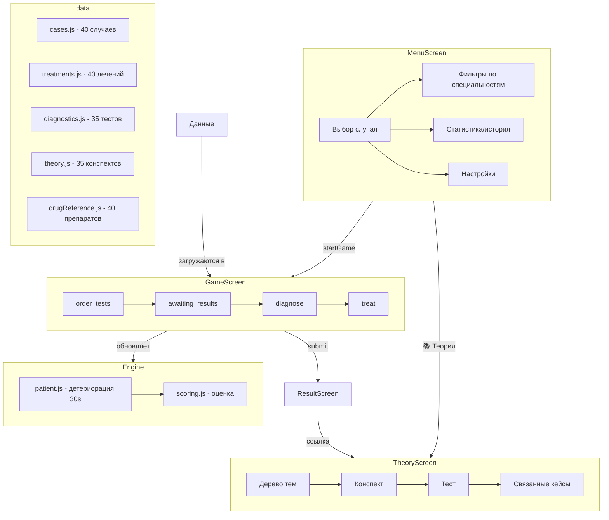

# MedSim - Медицинский симулятор

React/Vite SPA для тренировки клинического мышления. 46 клинических случаев по 7 специальностям.

## Инструкции для кода

1. **Early returns** — избегать вложенности `if/else`
2. **Native JS** — стандартная библиотека в приоритете над зависимостями
3. **Удалять мёртвый код** — `console.log`, закомментированное, неиспользуемые imports
4. **Файлы < 200 строк** — разбивать при превышении
5. **JSDoc** — комментарии для функций
6. Перед добавлением кода проверить, нельзя ли переиспользовать существующий

> ESLint + Prettier + Husky + lint-staged настроены: коммит автоматически прогоняет линт и формат.

## Сущность проекта

**Цель:** Имитация работы врача в реальном отделении. Пациент → диагностика → лечение → обратная связь.

**Формат:** Обучение + развлечение. Каждый случай — реальная клиническая задача с:
- Кратким временем (5-12 минут)  
- Детериорацией пациента
- Критическими решениями
- Дебрифингом от реального врача

## Архитектура

```
src/
├── MedSimApp.jsx          # Главный компонент (фазы приложения)
├── main.jsx               # Точка входа + глобальные стили
├── ui/
│   ├── components.jsx     # UI-компоненты (Vital, GCSBadge, PainBadge, Btn, CheckRow, TimerCircle, ResultCard)
│   ├── ThemeContext.jsx   # Тема (dark/light) + useTheme hook
│   └── theme.js           # Цвета тем (DARK, LIGHT, FONT, CODE, SER)
├── screens/
│   ├── MenuScreen.jsx     # Меню + выбор случая + статистика + настройки
│   ├── GameScreen.jsx     # Тонкий диспетчер: маршрутизация по отделениям
│   ├── ResultScreen.jsx   # Результаты + дебрифинг (curriculum, route, stationary)
│   ├── TheoryScreen.jsx   # Теория + справочник + протоколы + курс (curriculum mode)
│   ├── QuizModal.jsx      # Модальное окно тестирования (onResult callback)
│   ├── LeaderboardScreen.jsx  # Достижения + статистика
│   ├── CertificateScreen.jsx  # Сертификаты (17 шт.)
│   ├── OnboardingScreen.jsx   # 7-шаговый онбординг
│   └── game/
│       ├── EmergencyGameScreen.jsx    # ОРИТ: order→results→diagnose→treat (782 строки)
│       ├── OutpatientGameScreen.jsx   # Поликлиника: order→results→diagnose+route
│       └── StationaryGameScreen.jsx   # Стационар: morning→order→results→treat (суточный цикл)
├── hooks/
│   ├── useGameSession.js  # Игровая логика (детериорация, таймер, подсчёт)
│   ├── useSettings.js     # Настройки + localStorage (learningMode, assessmentMode, progressionMode)
│   ├── useProgress.js     # Прогресс + Curriculum (localStorage: темы, тесты, очередь курса)
│   ├── useStationaryCycle.js  # Суточный цикл стационара (день, виталы, назначения, выписка)
│   └── useIsMobile.js     # Определение мобильного устройства
├── locale/
│   ├── t.js               # Функция перевода
│   ├── useTranslate.js    # Hook перевода
│   ├── LocaleContext.jsx   # Контекст локализации
│   ├── ru.js              # Русская локализация
│   └── en.js              # Английская локализация
├── engine/
│   ├── patient.js         # Детериорация, вычисление исхода, clamp
│   ├── scoring.js         # Оценка (баллы, звёзды, штрафы)
│   ├── deterioration.js   # Чистые функции детериорации
│   └── severity.js        # Упрощённый индекс тяжести (SOFA-like, 0–20)
├── context/
│   └── AuthContext.jsx    # Контекст авторизации
├── api/
│   └── authApi.js         # API авторизации (localStorage)
└── data/
    ├── cases/
    │   ├── index.js              # Barrel export (46 кейсов)
    │   ├── outpatient.js         # 6 поликлинических случаев (correctRoute, routeOptions)
    │   ├── stationary.js         # 5 стационарных случаев (dayByDayPlan, dischargeCriteria)
    │   ├── cases_legacy.js       # Старый файл 35 случаев (не используется)
    │   └── emergency/
    │       ├── cardiac.js        # 7 кардиология
    │       ├── neuro.js          # 5 неврология
    │       ├── respiratory.js    # 6 пульмонология
    │       ├── infectious.js     # 5 инфекции
    │       ├── endocrine.js      # 3 эндокринология
    │       ├── toxicology.js     # 5 токсикология
    │       └── abdominal.js      # 4 хирургия
    ├── diagnostics.js     # 30 диагностических тестов
    ├── treatments.js      # 40 лечений + эффекты
    ├── topics.js          # Дерево тем (7 категорий, 35 тем) + маппинг тема→кейсы
    ├── theory.js          # 35 полных конспектов по всем темам
    ├── drugReference.js   # Справочник 40 препаратов
    ├── quiz.js            # 35 тестов (130 вопросов, смешанный формат)
    ├── protocols.js       # 5 протоколов (BLS, ACLS, ATLS, Sepsis, Stroke)
    └── certificates.js    # 17 сертификатов (общие + серия + режимы + специальности)
```

## Структура случая (CASES[])

```js
{
  id,                    // номер
  name,                  // "Фамипостроиливич Иванов Иван Иваныч" 
  age, gender,
  complaint,             // клиническая картина
  vitals: { bp, hr, rr, temp, spo2 },  // начальные ЖП
  initialGCS, initialPain,
  deterioration: {       // как меняются ЖП каждые 30 сек
    hr:+2, sbp:-2, rr:+1, spo2:-1, ...
  },
  deathThresholds: {     // при каких значениях пациент умирает
    sbp:48, spo2:65, gcs:4, hr:195
  },
  anamnesis, exam,       // клинические данные
  severity, category,    // critical/moderate, cardiac/neuro/etc
  diagnosis,             // что это вообще
  testResults: {ecg:"...", troponin:"🔴 ..."},  // результаты тестов
  needDiag: ["ecg", "troponin"],   // нужные тесты для диагностики
  needTreat: ["aspirin", "heparin"], // нужные лечения
  wrongTreat: ["metoprolol"],      // опасные лечения (штрафы)
  timeLimit: 12,                  // начальное время (минут)
  tip, debrief: {explain:"..."}    // совет и разбор
}
```

## Специальности (7)

| Специальность | Случаи | Иконка |
|--------------|--------|--------|
| **cardiac**     | ОИМ, ХСН, АВ-блокада, тампонада    | ❤️ |
| **neuro**       | Инсульт, менингит, эпилепсия      | 🧠 |
| **respiratory** | Пневмония, ХОБЛ, пневмоторакс, ОРДС, ТЭЛА | 🫁 |
| **infectious**  | Сепсис/шок, эндокардит, грипп, ПЦП, НФ | 🦠 |
| **endocrine**   | ДКА, тиреотоксикоз              | ⚗️ |
| **toxicology**  | Отравления, гипотермия           | ☠️ |
| **abdominal**   | ОКС, ЖКТ-кровотечения            | 🔬 |

## Игровой цикл

```
[MenuScreen] → startGame(case)
      ↓
[GameScreen: order_tests] → выбираешь диагностику
      ↓
[GameScreen: awaiting_results] → результаты приходят 1-2 сек
      ↓
[GameScreen: diagnose/treat] → выбираешь лечение + диагноз
      ↓
[ResultScreen] → баллы, оценка, объяснение
```

**Детериорация:** каждые 30 сек значения пациента меняются  
**Таймер:** обратный отсчёт → автосдача при 00:00  
**Статус:** stable → deteriorating → critical → dead

## Режимы игры

- **Обычный** — стандартная сложность
- **Стресс** — ×2 скорость детериорации, ×0.5 время
- **Случайный** — случайный случай без выбора
- **Теория → Практика** — изучение теории → тест → серия кейсов

## Система оценки

Итоговый балл `score` (0–100), считается в `engine/scoring.js → computeScore`.

- **Диагноз** — текстовый ввод, доля совпавших слов (`diagMatchRatio`):
  - ≥ 0.6 → +35 (`diagCorrect`)
  - ≥ 0.3 → +20 (`diagPartial`)
  - > 0 → +10
- **needDiag** — пропорционально: `(верных тестов / всего) × 20`
- **needTreat** — пропорционально: `(верных лечений / всего) × 25`
- **wrongTreat** — каждое опасное лечение = −15 (не ниже 0)
- **Исход пациента** (`computeOutcome`):
  - stable → +20 | unstable → +10 | critical → +3 | dead → −20
- **Бонус за время** — 0-15 баллов за скорость
- **Оценка** (`grade`): ≥85 Отлично | ≥70 Хорошо | ≥50 Удовлетворительно | иначе Неудовлетворительно

## Локализация

- Два языка: **RU** (по умолчанию) и **EN**
- Переключение: настройки (⚙️) → Язык / Language
- Все компоненты используют `t("key")` через `useTranslate` hook
- Переводы в `src/locale/ru.js` и `src/locale/en.js`

## Теория и обучение

- **35 тем** по 7 категориям (кардиология, неврология, пульмонология и др.)
- **Конспекты:** определение → этиология → патогенез → клиника → диагностика → лечение → прогноз
- **Справочник:** 40 препаратов с показаниями, противопоказаниями, дозировками
- **Тесты:** 35 тестов (130 вопросов), порог прохождения 70%
- **Протоколы:** BLS, ACLS, ATLS, Sepsis-3, Stroke
- **Изображения:** ассеты из Reanimation Inc (6 тем с иллюстрациями)

## Достижения

- **17 сертификатов:** общие (5) + серия (3) + режимы (2) + специальности (7)
- **Leaderboard:** ранг, статистика, прогресс по специальностям, топ-10
- **Onboarding:** 5-шаговый гайд для новичков

## Статистика проекта

| Метрика | Значение |
|---------|----------|
| Случаи | 46 (35 emergency + 6 outpatient + 5 stationary) |
| Лечения | 40 |
| Диагностические тесты | 30 |
| Темы теории | 35 |
| Препараты | 40 |
| Тесты (вопросы) | 35 (130) |
| Протоколы | 5 |
| Сертификаты | 17 |
| Режимы игры | 4 (обычный, стресс, случайный, курс) |
| Языки | 2 (RU, EN) |
| Специальности | 7 (cardiac, neuro, respiratory, infectious, endocrine, toxicology, abdominal) |
| Отделения | 3 (emergency, outpatient, stationary) |

## Ассеты Reanimation Inc

Извлечены из Unity-игры через UnityPy:
- `public/assets/reanimation/textures/` — 187 PNG (органы, ЭКГ, оборудование, UI)
- `public/assets/reanimation/audio/` — 20 OGG (дефибриллятор, ЭКГ-пульс, тревога, музыка)

Инструменты: AssetStudio v0.16.47, UnityPy 1.25.2, FFmpeg 8.1.2

## Добавление контента

### Новый случай в `cases.js`:
1. Скопировать любой случай как шаблон
2. Поменять `id`, `name`, `category`
3. Заполнить клинические данные
4. Указать `needDiag`/`needTreat`/`wrongTreat`

### Новое лечение в `treatments.js`:
```js
TREATMENTS = [..., {id:"new_drug", name:"Новое лечение", cat:"supportive"}]
TREAT_FX.new_drug = {eff:{sbp:+5,hr:-2}, desc:"Описание эффекта", delay:60}
ADVERSE_FX.new_drug = {eff:{sbp:-10}} // если опасно
```

### Новый тест в `diagnostics.js`:
```js
DIAGNOSTICS = [..., {id:"new_test", name:"Название", cat:"lab"}]
MISSED_TEST_REASONS.new_test = "Почему важен..."
```

### Новая тема теории:
1. Добавить в `topics.js` (дерево тем)
2. Добавить конспект в `theory.js`
3. Добавить вопросы в `quiz.js`
4. Связать с кейсами через `cases[]` в topics.js

## Визуальная схема



## Полезные паттерны

- **Формат случая стандартизован** → легко генерировать новые
- **Все эффекты в виде `{param: значение}`** → легко добавлять
- **Текст на русском** → контекст реального пациента в РФ
- **i18n через `t()`** → все строки через ключи локализации
- **Настройки в localStorage** → persist между сессиями
- **Тема dark/light** → через ThemeContext + CSS-переменные

## Координация субагентов
- **Software Architect**: Проектирование чистой архитектуры, хуков, логики движка в `src/engine/`.
- **Medical Auditor**: Валидация медицинских данных согласно ТЗ и клин. рекомендациям РФ.
- **Senior Frontend (UI/UX)**: Верстка премиального Stripe/Linear интерфейса, адаптивность.
- **Localization**: Синхронизация файлов перевода `ru.js` и `en.js`.
- **Code Reviewer**: Проверка качества кода, файлов строго < 200 строк.
- **Medical Student**: Оценка UX/UI, геймификации, сложности и ценности теории с позиции студента медвуза РФ.
- **Пайплайн**: Архитектура/Медицина/Аудитория -> Реализация -> Локализация -> Ревью -> Финал.
