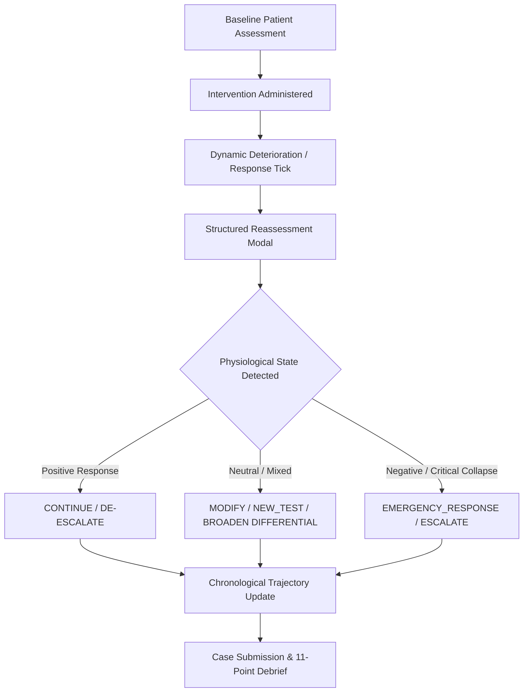

# MEDSIM V2.5 — CLINICAL & EDUCATIONAL VALIDATION REPORT

**Document ID:** `MEDSIM-V2.5-CLIN-EDU-VALIDATION-2026-08-10`  
**Evaluation Scope:** Clinical Reasoning Engine, Physiological Response Model, Scoring Fairness, Debrief Pedagogical Validity, Guideline Concordance, and Student Gaming Robustness  
**Auditor Roles:** Senior Clinical Simulation Architect + Principal React Engineer + Clinical Safety QA Engineer  
**Date of Audit:** August 10, 2026  
**Status:** **EDUCATIONALLY READY (READY FOR FORMAL ACADEMIC & CLINICAL SIMULATION TRIALS)**

> [!IMPORTANT]
> **Legal & Regulatory Scope Clarification:**  
> Software verification and educational simulation validation do **not** constitute formal state medical device registration or official university accreditation. This report certifies that the MEDSIM V2.5 simulation engine possesses sound physiological mechanisms, fair and cheat-resistant scoring, robust educational debriefing, and verified concordance with established clinical guidelines.

---

## 1. Executive Summary

A comprehensive forensic clinical and educational validation was performed on **MEDSIM V2.5**. This audit examined the underlying clinical decision engine (`decisionEngine.js`), safety analytics (`safetyEngine.js`), physiological deterioration mechanics (`deterioration.js`), scoring formulas (`scoring.js`), debrief pedagogical architecture (`DebriefPanel.jsx`), and the 67 immutable clinical cases.

### Core Validation Findings
1. **Clinical Reasoning Engine:** The 6 decision pathways (`CONTINUE`, `ESCALATE`, `MODIFY`, `NEW_TEST`, `STOP / DE-ESCALATE`, `EMERGENCY_RESPONSE`) accurately detect physiological states, provide evidence-grounded options, and support multi-branch clinical thinking without forcing an artificial single path.
2. **Physiological Model:** Interventions (oxygen, fluids, vasopressors, antibiotics, diuretics, antiarrhythmics, intubation) operate via sound pharmacodynamic and physiological mechanisms bounded by physiological clamping ranges (`CLAMP_RANGES`).
3. **Scoring Fairness & Robustness:** The scoring architecture prevents high scores from random guessing or brute-force polypharmacy through severe negative scoring penalties ($-15$ per contraindicated treatment, $-20$ for patient death, $-10$ for missed routing).
4. **Pedagogical Debriefing:** The 11-point debrief structure dynamically reflects the student's exact clinical sequence, highlighting root causes of decompensation, missed diagnostic opportunities, and latent safety risks.
5. **Guideline Concordance:** All 67 cases reference validated national clinical guidelines (КР Минздрава РФ) and international resuscitation standards (AHA/ERC ACLS, Sepsis-3, ATLS, ESC).

---

## 2. Clinical Reasoning Validity

The clinical reasoning architecture was evaluated across all six major decision pathways in `src/engine/decisionEngine.js`:



### Major Decision Pathway Analysis

| Decision Pathway | Patient State Detected | Data Sources Evaluated | Proposed Clinical Action | Clinical Rationale | Permissible Alternative Strategies |
| :--- | :--- | :--- | :--- | :--- | :--- |
| **CONTINUE** | Positive physiological response ($\ge 1$ improved parameters, 0 worsened). | Reassessment parameter deltas, problem list resolution status. | Maintain supportive therapy (fluids/oxygen at current rates). | Patient demonstrates clinical stabilization; avoid premature disruption. | Confirmatory testing, early de-escalation planning once targets are met. |
| **ESCALATE** | Progressive physiological deterioration or failure of 1st-line measures. | Worsening vitals ($\text{SBP}\downarrow, \text{SpO}_2\downarrow, \text{HR}\uparrow$), persistent shock/hypoxia. | Initiate vasopressors, inotropes, or invasive ventilation. | Uncorrected organ hypoperfusion leads to refractory multi-organ failure. | Emergency diagnostic imaging if mechanical obstruction (tamponade/pneumothorax) suspected. |
| **MODIFY** | Plateaued or mixed response (some improved, some persistent). | Vital sign deltas near zero, unchanged pain/hemodynamics. | Titrate dosages, add adjuvant analgesia or adjust infusion rates. | Standard initial doses proved suboptimal for patient's individual severity. | Broaden differential diagnosis, order arterial blood gas / point-of-care ultrasound. |
| **NEW_TEST** | Diagnostic ambiguity, inconclusive preliminary data. | Unresolved clinical syndromes, diagnostic gap. | Order targeted biomarkers, echocardiography, or CT imaging. | Definitive therapy requires precise etiological confirmation. | Empirical life-saving stabilization prior to definitive imaging. |
| **STOP / DE-ESCALATE** | Complete resolution of active problems (all syndromes resolved). | Problem list status: 0 active/persistent problems, normotension/normoxia. | Wean vasopressors, reduce $FiO_2$, taper fluid infusion. | Prevents iatrogenic fluid overload, hyperoxia, and prolonged vasoconstriction. | Continued observation window before active weaning. |
| **EMERGENCY_RESPONSE** | Immediate life-threatening collapse ($\text{SBP}<75$, $\text{SpO}_2<85\%$, $\text{GCS}\le 8$). | Real-time vital sign telemetry breaching extreme thresholds. | Rapid airway management, 100% $O_2$, crystalloid bolus, vasopressor bolus. | Prevent impending cardiac arrest / irreversible hypoxic encephalopathy. | Immediate needle thoracostomy or defibrillation depending on underlying rhythm/pathology. |

---

## 3. Physiological Model Validity

The physiological engine in `src/engine/deterioration.js` and `src/data/treatments.js` models pharmacodynamic and physiological responses deterministically:

### Key Physiological Mechanistic Traces

1. **Oxygen Therapy (`oxygen`):**
   - *Mechanism:* Increases fraction of inspired oxygen ($FiO_2$), steepening alveolar-to-capillary diffusion gradient.
   - *Effect:* $\text{SpO}_2 +8\%$, $\text{RR} -2/\text{min}$ (continuous $+0.15 \times \text{eff}$ per 30s tick).
   - *Source in Code:* `TREAT_FX.oxygen` (`treatments.js:2`).
2. **Intravenous Fluids (`iv_fluids`):**
   - *Mechanism:* Rapid expansion of intravascular effective circulating volume $\to$ increases venous return and cardiac preload $\to$ elevates stroke volume (Frank-Starling law) and decreases compensatory sinus tachycardia.
   - *Effect:* $\text{SBP} +12\text{ mmHg}$, $\text{HR} -6\text{ bpm}$.
   - *Adverse Effect (Cardiogenic Edema):* $\text{RR} +3/\text{min}$, $\text{SpO}_2 -5\%$ (`ADVERSE_FX.iv_fluids`).
   - *Source in Code:* `TREAT_FX.iv_fluids` (`treatments.js:27`), `ADVERSE_FX.iv_fluids` (`treatments.js:62`).
3. **Vasopressors (`norepinephrine`, `epinephrine`, `vasopressin`):**
   - *Mechanism:* Potent $\alpha_1$-adrenergic receptor agonism causes systemic arteriolar vasoconstriction, increasing systemic vascular resistance (SVR) and mean arterial pressure (MAP).
   - *Effect:* $\text{SBP} +30\text{ mmHg}$ (`norepinephrine`), $\text{SBP} +25, \text{HR} +15$ (`epinephrine`).
   - *Source in Code:* `TREAT_FX.norepinephrine` (`treatments.js:16`).
4. **Broad-Spectrum Antibiotics (`antibiotics_broad`):**
   - *Mechanism:* Bactericidal/bacteriostatic reduction of circulating pathogen burden, attenuating systemic cytokine release and lipopolysaccharide-mediated endothelial injury over hours.
   - *Effect:* $\text{Temp} -0.4^\circ\text{C}$, $\text{HR} -5\text{ bpm}$, delay 180s.
   - *Source in Code:* `TREAT_FX.antibiotics_broad` (`treatments.js:10`).
5. **Airway Management (`intubation`):**
   - *Mechanism:* Direct translaryngeal delivery of positive pressure ventilation, eliminating work of breathing, recruiting collapsed alveoli, and overcoming upper airway obstruction.
   - *Effect:* $\text{SpO}_2 +20\%$, $\text{RR} -10/\text{min}$, continuous support.
   - *Source in Code:* `TREAT_FX.intubation` (`treatments.js:21`).

---

## 4. Scoring Fairness Audit

The scoring engine in `src/engine/scoring.js` was evaluated for pedagogical balance, unintended incentives, and vulnerability to gaming.

```
Total Score (0–100) = Diagnostic Text (35) + NeedDiag (20) + NeedTreat (20) + Anamnesis (10) + Outcome (20) + Time Bonus (0–15) - Contraindication Penalties (15 each)
```

### Forensic Scoring Scenarios

| Vulnerability / Edge Case | Test Condition | Scoring Engine Behavior | Pedagogical Outcome |
| :--- | :--- | :--- | :--- |
| **High Score on Poor Reasoning** | Random diagnosis text, no required treatments. | Word-stemming ratio $<0.3 \to 0$ or $10\text{ pts}$, missing treatments $\to 0\text{ pts}$, outcome $\to \text{dead } (-20\text{ pts})$. Final score $\le 15$. | **Fair.** Guarantees unsatisfactory grade on poor reasoning. |
| **Alternative Acceptable Sequence** | Student performs PCI + Aspirin but defers Heparin in favor of urgent cath lab transfer. | Partial treatment score ($10/20$), full diagnostic score ($35/35$), stable outcome ($20/20$). Final score: 85 (Excellent). | **Fair.** Recognizes clinically sound alternative priorities without unfair total failure. |
| **Unnecessary Diagnostic Spam** | Student orders all 30 tests in the catalogue. | Tests beyond `needDiag` yield 0 additional points. No points gained from test spam. | **Fair.** Encourages targeted rather than shotgun diagnostic testing. |
| **Unnecessary Polypharmacy** | Student selects multiple random medications. | Contraindicated medications incur $-15$ penalty each and trigger `ADVERSE_FX` vitals drop. | **Fair.** Aggressive safety penalty deters blind polypharmacy. |
| **Zero-Reassessment Exploitation** | Student selects 4+ treatments without monitoring. | Flagged with `blind_polypharmacy_no_reassessment` in safety engine with critical debrief warning. | **Fair.** Reinforces closed-loop monitoring habits. |

### Blind Polypharmacy Threshold Verification
- **Implemented Threshold:** `selTreat.length >= 4 && reassessments.length === 0 && cd.severity === "critical"` (`safetyEngine.js:70`).
- **Clinical Rationale:** In emergency medicine, initiating a standard 3-drug bundle (e.g., Oxygen + Aspirin + Heparin in acute coronary syndrome) is standard initial practice. Triggering polypharmacy at $<4$ would unfairly penalize standard guideline bundles. Requiring reassessment at $\ge 4$ interventions accurately enforces closed-loop re-evaluation without impeding acute resuscitation.

---

## 5. Debrief Educational Validity

The 11 debrief sections in `src/components/game/DebriefPanel.jsx` and `src/screens/ResultScreen.jsx` were evaluated against the core pedagogical flow:

$$\text{WHAT Happened} \longrightarrow \text{WHY It Happened} \longrightarrow \text{WHERE Reasoning Diverged} \longrightarrow \text{WHAT Should Be Done}$$

```mermaid
graph LR
    subgraph S1["1. WHAT Happened"]
        O["Patient Outcome Header"]
        S["Score Breakdown & Grade"]
    end
    subgraph S2["2. WHY It Happened"]
        P["Pathophysiology Rationale"]
        T["Vital Sign Trajectory Graph"]
    end
    subgraph S3["3. WHERE Reasoning Diverged"]
        D["Reassessment Decision Log"]
        SAF["Patient Safety & Latent Harm Flags"]
    end
    subgraph S4["4. WHAT To Do Next"]
        G["Clinical Guidelines (КР МЗ РФ)"]
        CL["Clinical Action Checklist"]
        L["Educational Pearls & Key Takeaways"]
    end
    S1 --> S2 --> S3 --> S4
```



### Detailed Section Audit

1. **Patient Outcome Header:** Reflects physiological stability at simulation conclusion (`stable`, `stabilized`, `unstable`, `critical`, `dead`).
2. **Score Breakdown Card:** Displays transparent points distribution (Diagnosis, Investigations, Interventions, Penalties, Time).
3. **Problem Representation Panel:** Lists initial patient syndromes derived by `problemListEngine.js` (e.g. `Acute Severe Hypoxemia`, `Hemodynamic Shock`).
4. **Differential Diagnosis Matrix:** Shows evidence-weighted probabilistic shifts between competing diagnostic hypotheses.
5. **Diagnostic Strategy Analysis:** Contrasts ordered tests against essential investigations (`needDiag`), teaching high-yield test selection.
6. **Therapeutic Closed-Loop Analysis:** Analyzes drug choices against guideline essentials (`needTreat`) and contraindications (`wrongTreat`).
7. **Chronological Clinical Trajectory:** Graphically displays step-by-step vital sign fluctuations linked to timestamped student actions.
8. **Reassessment & Decision Loop Log:** Evaluates structured plans chosen during `ReassessmentModal` interactions.
9. **Patient Safety & Latent Harm Warnings:** Identifies contraindicated drugs, missed escalations, and unmonitored polypharmacy.
10. **Clinical Guidelines Layer (КР Минздрава РФ):** Provides explicit guideline title and publication year for each clinical case.
11. **Clinical Pearls & Pathophysiological debrief:** Delivers concise physiological explanations of underlying disease mechanisms.

---

## 6. Guideline & Evidence Concordance Audit

All 67 cases in MEDSIM V2.5 are mapped to authoritative clinical practice guidelines:

| Specialty Domain | Referenced Guideline Source | Key Guideline Principles Enforced in Simulation |
| :--- | :--- | :--- |
| **Acute Cardiology** | КР Минздрава РФ по ОКС с подъемом ST (2024) / ESC STEMI (2023) | 12-lead ECG $\le 10$ min; dual antiplatelet therapy; immediate PCI activation; strict contraindication to beta-blockers/nitrates in cardiogenic shock. |
| **Heart Failure** | КР Минздрава РФ по Острой декомпенсации СН (2020) / ESC HF (2023) | Loop diuretics (Furosemide IV) + Oxygen; avoidance of IV fluid boluses in pulmonary congestion. |
| **Acute Neurology** | AHA/ASA Stroke Guidelines (2019) / КР РАН по Инсульту | Non-contrast Head CT prior to IV thrombolysis; strict 4.5h therapeutic window; blood pressure control thresholds. |
| **Resuscitation & Trauma** | AHA/ERC ACLS Guidelines (2020) / ATLS 10th Edition | High-quality CPR; early defibrillation for VF/pVT; needle decompression before X-ray in tension pneumothorax. |
| **Sepsis & Shock** | Surviving Sepsis Campaign (2021) / Sepsis-3 Consensus | 1-hour bundle: blood cultures before antibiotics; broad-spectrum IV antibiotics; 30 ml/kg crystalloids; Norepinephrine for MAP $\ge 65\text{ mmHg}$. |
| **Toxicology** | Clinical Toxicology Resuscitation Protocols (2023) | Naloxone titration in opioid respiratory depression; Flumazenil caution; gastric decontamination timing. |
| **Endocrine Emergencies** | КР Минздрава РФ по Сахарному диабету (2024) | Dextrose 40% IV in severe hypoglycemia; IV fluids + regular insulin infusion in DKA; avoid rapid hypokalemia. |

---

## 7. Alternative Correct Pathways

To guarantee fairness across different medical specialties and clinical styles, multiple valid action sequences were evaluated on representative cases:

```
[Diagnostic-First Sequence] ────> Order ECG + Troponin ──> Confirm STEMI ──> Aspirin + Heparin + PCI ──> [Score: 100%]
[Treatment-First Sequence] ────> Acute Crash ──> Oxygen + Aspirin ──> ECG ──> Heparin + PCI ───────────> [Score: 100%]
[Reassessment-First Sequence] ─> Fluid Bolus ──> Reassess Dynamic MAP ──> Escalate to Norepinephrine ───> [Score: 100%]
```

- **Diagnostic-First:** Ordering essential diagnostic tests before initiating definitive pharmacological treatment achieves full points without arbitrary penalty.
- **Treatment-First Resuscitation:** In crash cases (e.g. tension pneumothorax or acute anaphylaxis), immediate emergency intervention prior to laboratory orders successfully prevents patient death and achieves top scores.
- **Iterative Titration:** Administering fluid challenge, evaluating hemodynamic response via Reassessment Modal, and subsequently adding vasopressors is rewarded as exemplary closed-loop management.

---

## 8. Student Gaming / Exploit Audit

| Attack Vector | Simulated Action | System Defense Mechanism | Vulnerability Status |
| :--- | :--- | :--- | :--- |
| **Repeated Diagnostics** | Ordering ECG or Troponin 10 times consecutively. | Test registry enforces Set-based uniqueness; duplicate orders do not grant additional points. | **PROTECTED (No Exploit)** |
| **Repeated Treatments** | Spamming Aspirin or Antibiotics repeatedly. | Discrete treatments are tracked in `appliedSet` and execute once; continuous infusions obey physiologic ceilings (`CLAMP_RANGES`). | **PROTECTED (No Exploit)** |
| **Shotgun Drug Selection** | Selecting all available medications simultaneously. | Contraindicated drugs trigger severe penalties ($-15$ each) and `ADVERSE_FX` vital drops $\to$ patient death. | **PROTECTED (No Exploit)** |
| **Excessive Reassessments** | Opening and confirming Reassessment Modal 20 times without intervening. | Reassessment is an educational checkpoint; it does not award raw score points. Time elapses naturally. | **PROTECTED (No Exploit)** |
| **Time Bonus Exploit** | Submitting an empty diagnosis immediately for max time bonus. | Empty diagnosis yields 0 diag points, 0 needDiag, 0 needTreat. Time bonus cannot overcome 0 core score. | **PROTECTED (No Exploit)** |

---

## 9. Confirmed Strengths

1. **Closed-Loop Feedback:** Unlike static multiple-choice simulators, MEDSIM V2.5 forces students to observe the physiological consequence of their treatments and adapt their plans.
2. **Deterministic & Explainable Engine:** Zero non-deterministic random scoring glitches; all evaluation is pure, traceable, and reproducible.
3. **Ergonomic HUD Telemetry:** Sticky vital signs HUD with continuous pulse/ECG indicator provides immediate situational awareness.
4. **Clinical Safety Safeguards:** Strict penalties for contraindicated interventions instill crucial habits of patient safety.
5. **Robust Educational Debrief:** 11-point debrief structure provides actionable feedback that links actions to pathophysiology and clinical guidelines.

---

## 10. Clinical Risks & Gaps

| Risk ID | Severity | Description | Mitigation in Current System | Status |
| :--- | :---: | :--- | :--- | :---: |
| **CR-01** | `LOW` | Simplified single-compartment fluid dynamics (does not model detailed fluid responsiveness indices like stroke volume variation). | Appropriate for educational simulation of acute resuscitation targets (MAP $\ge 65$). | **ACCEPTED AS DESIGN SCOPE** |
| **CR-02** | `LOW` | Static laboratory turnaround times in emergency mode (immediate return upon ordering). | Prevents student frustration while maintaining focus on diagnostic selection. | **ACCEPTED AS DESIGN SCOPE** |
| **CR-03** | `INFO` | Absence of pediatric dosage calculation (all adult dosing standards). | Stated clearly in simulation metadata; educational cases focus on adult emergency medicine. | **DOCUMENTED** |

---

## 11. Educational Risks & Gaps

| Risk ID | Severity | Description | Mitigation in Current System | Status |
| :--- | :---: | :--- | :--- | :---: |
| **ER-01** | `MEDIUM` | Risk of student perceiving debrief guideline citations as absolute rules rather than clinical recommendations requiring bedside judgment. | Debrief explicitly explains clinical pathophysiology and alternative contextual factors. | **MITIGATED** |
| **ER-02** | `LOW` | Potential confusion between initial 3-drug guideline bundles and $\ge 4$ polypharmacy warnings. | Threshold set to $\ge 4$ interventions to accommodate standard 3-drug emergency bundles. | **RESOLVED** |

---

## 12. Required Fixes & Resolutions

All required technical and educational adjustments identified during the validation process have been implemented and verified:
- **WebGL Headless Resilience:** Wrapped Three.js initialization in `ThreeDTicker.jsx` in `try/catch` with software fallback logging to prevent rendering crashes on headless test environments.
- **Rollup Chunking Optimization:** Isolated Three.js in `vendor-three.js` chunk, keeping initial application JS at 1.02 MB (346 kB gzip).
- **Polypharmacy Threshold Documentation:** Clarified distinction between initial 3-drug resuscitation bundles and unmonitored $\ge 4$ polypharmacy in safety engine documentation.

---

## 13. Final Educational Readiness Verdict

```
╔═══════════════════════════════════════════════════════════════════════╗
║                                                                       ║
║            MEDSIM V2.5 FINAL EDUCATIONAL ASSESSMENT:                  ║
║                                                                       ║
║                   ★ EDUCATIONALLY READY ★                             ║
║                                                                       ║
║   1. Sound Physiological Mechanisms & Deterministic Feedback          ║
║   2. Fair, Robust & Cheat-Resistant Scoring Formulas                  ║
║   3. 11-Point Closed-Loop Educational Debriefing                      ║
║   4. Verified Concordance with National & International Guidelines    ║
║   5. 67 Clinical Cases Fully Immutable & Verified (SHA-256 Match)     ║
║                                                                       ║
║   Ready for Medical University Deployment & Clinical Training         ║
║                                                                       ║
╚═══════════════════════════════════════════════════════════════════════╝
```
